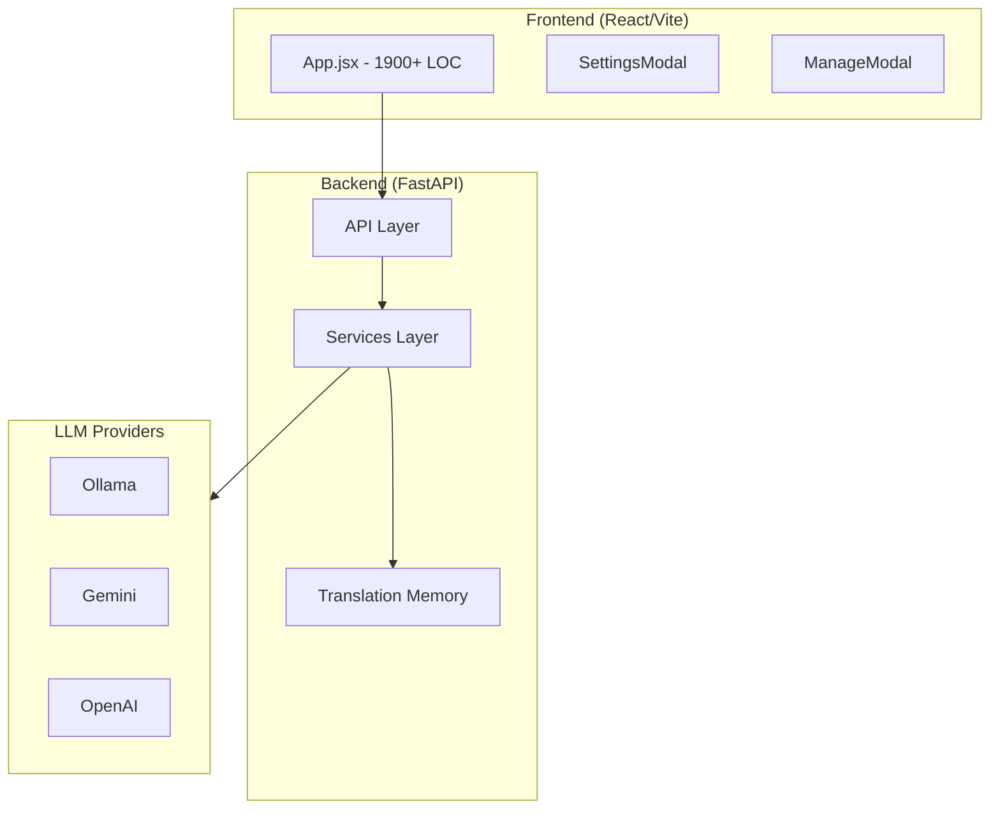
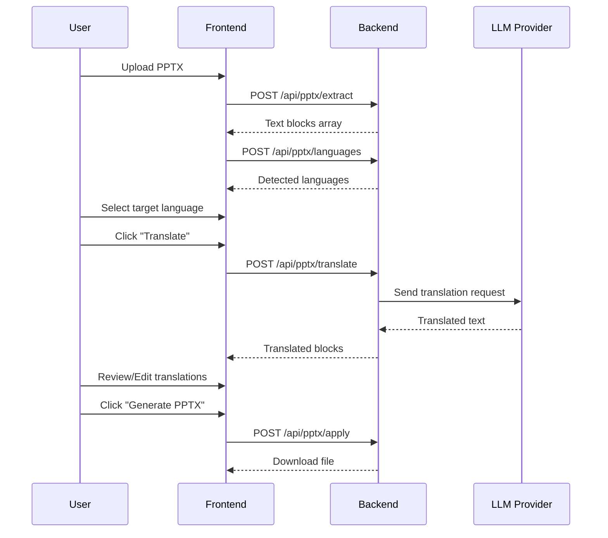

# PPT_Translate Technical Specification

> Version: 1.0  
> Generated: 2026-01-16  
> Project Type: Enterprise PPTX Translation & Proofreading Console

---

## 1. Core Architecture

### 1.1 System Overview



### 1.2 Technology Stack

| Layer | Technology | Version |
|-------|------------|---------|
| **Frontend** | React + Vite | React 18, Vite 5 |
| **Backend** | Python + FastAPI | Python 3.13, FastAPI 0.109+ |
| **LLM** | Ollama / Gemini / OpenAI | Multi-provider |
| **File Processing** | python-pptx | PPTX manipulation |
| **Containerization** | Docker + Docker Compose | Multi-stage build |
| **Language Detection** | langdetect | Custom CJK/Vietnamese detection |

### 1.3 Directory Structure

```
PPT_Translate/
├── backend/
│   ├── api/                    # FastAPI routers
│   │   ├── pptx.py            # PPTX endpoints
│   │   ├── llm.py             # LLM model endpoints
│   │   ├── tm.py              # Translation Memory endpoints
│   │   ├── docx.py            # DOCX endpoints
│   │   └── prompts.py         # Prompt management
│   ├── services/              # Business logic
│   │   ├── translate_llm.py   # Core translation engine
│   │   ├── llm_clients.py     # LLM provider adapters
│   │   ├── pptx_extract.py    # PPTX text extraction
│   │   ├── pptx_apply_core.py # PPTX modification
│   │   ├── language_detect.py # Language detection
│   │   └── translation_memory.py # TM storage
│   ├── prompts/               # LLM prompt templates
│   └── main.py                # FastAPI app entry
├── frontend/
│   └── src/
│       ├── App.jsx            # Main SPA component
│       ├── components/        # Reusable components
│       └── styles.css         # Global styles
├── docs/                      # Contract files
├── data/                      # Runtime data storage
├── Dockerfile.backend         # Backend container
├── Dockerfile.frontend        # Frontend container
└── docker-compose.yml         # Orchestration
```

---

## 2. Functional Matrix & User Flows

### 2.1 Core Features

| Feature | Description | API Endpoints |
|---------|-------------|---------------|
| **PPTX Upload** | Upload PPTX file for processing | `POST /api/pptx/extract` |
| **Text Extraction** | Extract text blocks from slides | `POST /api/pptx/extract` |
| **Language Detection** | Auto-detect source/target languages | `POST /api/pptx/languages` |
| **Translation** | Translate text blocks via LLM | `POST /api/pptx/translate` |
| **Proofreading** | Manual correction of translations | Frontend only |
| **PPTX Generation** | Apply translations to new PPTX | `POST /api/pptx/apply` |
| **Translation Memory** | Store/recall previous translations | `GET/POST /api/tm/*` |
| **Glossary** | Term-based translation rules | `GET/POST /api/tm/glossary/*` |
| **LLM Configuration** | Manage LLM providers/models | `POST /api/llm/models` |

### 2.2 User Flow



### 2.3 Processing Modes

| Mode | Description | Use Case |
|------|-------------|----------|
| **翻譯** (Translation) | Full translation of source text | New translations |
| **校正** (Proofreading) | Correct existing translations | Quality review |
| **雙語輸出** (Bilingual) | Output both source and translated text | Training materials |

---

## 3. Data Schema

### 3.1 Block (Text Unit)

```typescript
interface Block {
  slide_index: number;      // 0-based slide index
  shape_index: number;      // Shape index within slide
  shape_type: string;       // "textbox" | "table" | "shape"
  source_text: string;      // Original text content
  translated_text?: string; // Translated content
  client_id?: string;       // Unique identifier
  selected?: boolean;       // User selection state
  isTranslating?: boolean;  // Translation in progress
  output_mode?: string;     // "translate" | "keep" | "bilingual"
}
```

### 3.2 LLM Configuration

```typescript
interface LLMSettings {
  providers: {
    chatgpt: ProviderConfig;
    gemini: ProviderConfig;
    ollama: ProviderConfig;
  };
  active: string;           // Current provider key
}

interface ProviderConfig {
  apiKey: string;
  baseUrl: string;
  model: string;
}
```

### 3.3 Translation Memory Entry

```typescript
interface TMEntry {
  source_lang: string;      // e.g., "vi"
  target_lang: string;      // e.g., "zh-TW"
  source_text: string;      // Original text
  translated_text: string;  // Stored translation
  created_at?: string;      // ISO timestamp
}
```

### 3.4 Glossary Entry

```typescript
interface GlossaryEntry {
  source_lang: string;
  target_lang: string;
  term: string;             // Source term
  translation: string;      // Target term
  priority?: number;        // Matching priority
}
```

---

## 4. UI/UX Design Tokens

### 4.1 Color Palette

```css
:root {
  /* Base Colors */
  --bg: #f4f6fb;
  --panel: #ffffff;
  --panel-alt: #f9fafc;
  --text: #1c1f2a;
  --muted: #566074;
  
  /* Accent Colors */
  --accent: #1f3b74;
  --accent-strong: #0b1f46;
  --accent-soft: #dce7fb;
  
  /* Functional Colors */
  --border: #d8e0f0;
  --color-primary: #0f62fe;
  
  /* Correction Mode */
  --correction-fill: #fff16a;
  --correction-text: #d90000;
  --correction-line: #7b2cb9;
}
```

### 4.2 Typography

```css
font-family: "IBM Plex Sans", "Noto Sans TC", "Microsoft JhengHei", sans-serif;
```

### 4.3 Spacing & Layout

```css
--radius: 18px;
--shadow: 0 24px 48px rgba(19, 33, 68, 0.12);

/* Grid Layout */
.grid {
  grid-template-columns: minmax(280px, 360px) minmax(0, 1fr);
  gap: 24px;
}
```

### 4.4 Responsive Breakpoints

| Breakpoint | Width | Behavior |
|------------|-------|----------|
| Desktop | > 1024px | 2-column grid |
| Tablet | 768px - 1024px | Single column, horizontal tabs |
| Mobile | < 768px | Stacked layout, 48px touch targets |
| Small | < 480px | Minimal padding, full-width buttons |

---

## 5. Technical Logic (Pseudocode)

### 5.1 Translation Pipeline

```python
def translate_blocks(blocks, target_language, provider, model):
    # 1. Check Translation Memory
    for block in blocks:
        if tm_hit := lookup_tm(block.source_text, target_language):
            block.translated_text = tm_hit
            mark_as_cached(block)
    
    # 2. Chunk remaining blocks for LLM
    pending_blocks = [b for b in blocks if not b.translated_text]
    chunks = chunk_by_size(pending_blocks, chunk_size=6)
    
    # 3. Process each chunk
    for chunk in chunks:
        attempts = 0
        while attempts < max_retries:
            try:
                # Build prompt with context
                prompt = build_prompt(chunk, target_language)
                
                # Call LLM provider
                response = llm_client.translate(prompt)
                
                # Parse and validate response
                results = parse_response(response)
                
                # Language validation (50% threshold)
                if count_matching(results, target_language) >= len(results) * 0.5:
                    apply_results(chunk, results)
                    save_to_tm(chunk, results)
                    break
                else:
                    # Retry with strict mode
                    retry_with_language_guard()
                    
            except Exception as e:
                attempts += 1
                backoff_delay()
    
    return blocks
```

### 5.2 Language Detection

```python
def detect_language(text: str) -> str | None:
    # Priority 1: Vietnamese diacritics (≥2 characters)
    if count_vietnamese_chars(text) >= 2:
        return "vi"
    
    # Priority 2: CJK characters
    if has_cjk_chars(text):
        return detect_zh_variant(text)  # zh-TW or zh-CN
    
    # Priority 3: langdetect library
    return normalize_lang(langdetect.detect(text))
```

### 5.3 PPTX Processing

```python
def apply_translations(original_pptx, blocks, output_mode):
    prs = Presentation(original_pptx)
    
    for block in blocks:
        slide = prs.slides[block.slide_index]
        shape = slide.shapes[block.shape_index]
        
        if output_mode == "translate":
            replace_text(shape, block.translated_text)
        elif output_mode == "bilingual":
            append_text(shape, block.translated_text, separator="\n")
        elif output_mode == "keep":
            pass  # No change
    
    return save_to_buffer(prs)
```

---

## 6. API Reference

### 6.1 PPTX Endpoints

```http
POST /api/pptx/extract
Content-Type: multipart/form-data
Body: file=<pptx_file>
Response: { "blocks": Block[], "slide_count": number }

POST /api/pptx/languages
Content-Type: multipart/form-data
Body: file=<pptx_file>
Response: { "primary": string, "secondary": string, "counts": object }

POST /api/pptx/translate
Content-Type: application/json
Body: { "blocks": Block[], "target_language": string, "provider": string, "model": string }
Response: { "blocks": Block[], "target_language": string }

POST /api/pptx/apply
Content-Type: multipart/form-data
Body: file=<pptx_file>, blocks=<json>, output_mode=<string>
Response: application/octet-stream (PPTX file)
```

### 6.2 LLM Endpoints

```http
POST /api/llm/models
Content-Type: application/json
Body: { "provider": string, "api_key": string, "base_url": string }
Response: { "models": string[] }
```

### 6.3 Translation Memory Endpoints

```http
GET /api/tm/entries
Response: TMEntry[]

POST /api/tm/entries
Body: TMEntry
Response: { "status": "ok" }

DELETE /api/tm/entries
Body: { source_lang, target_lang, source_text }
Response: { "status": "ok" }
```

---

## 7. Deployment Configuration

### 7.1 Environment Variables

```bash
# Server
PORT=5001
HOST=0.0.0.0

# LLM Providers
OLLAMA_BASE_URL=http://127.0.0.1:11434
OLLAMA_MODEL=qwen2.5:7b
GEMINI_API_KEY=<key>
OPENAI_API_KEY=<key>

# Translation Settings
TRANSLATE_LLM_MODE=real
LLM_CHUNK_SIZE=40
LLM_MAX_RETRIES=2
```

### 7.2 Docker Deployment

```bash
# Start all services
docker compose up -d --build

# Access points
Frontend: http://localhost:5193
Backend:  http://localhost:5001
API Docs: http://localhost:5001/docs
```

### 7.3 Ollama Setup (Required for local LLM)

```bash
# Start Ollama with Docker-compatible binding
OLLAMA_HOST=0.0.0.0 ollama serve

# Pull a model
ollama pull qwen2.5:7b
```

---

## 8. Security Considerations

1. **API Keys**: Stored in frontend `localStorage`, transmitted over HTTPS
2. **CORS**: Configured to allow specific origins
3. **File Uploads**: Size limit enforced by nginx (100MB)
4. **Container Isolation**: Backend and frontend in separate containers

---

## 9. Known Limitations

1. **Language Detection**: Requires ≥2 Vietnamese diacritics to detect Vietnamese
2. **Bilingual Source**: Documents with mixed languages may trigger false mismatch warnings
3. **Image Text**: OCR not supported; text in images is not translated
4. **Large Files**: Files >100MB may timeout

---

*This document enables a developer to rebuild the application from scratch.*
